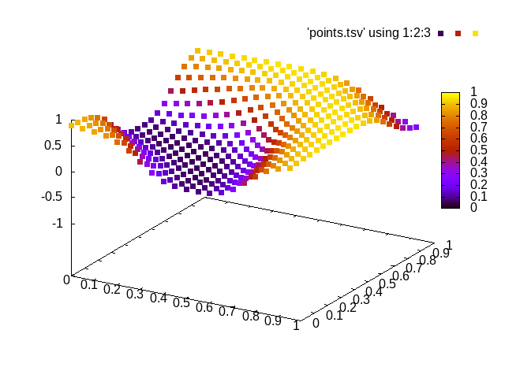
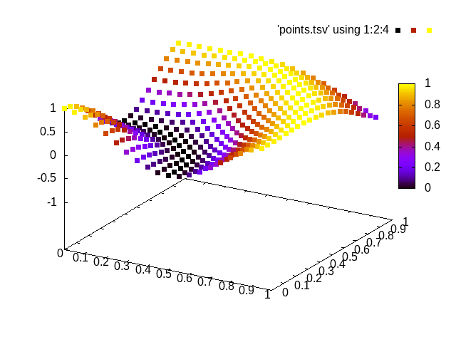

# neuralnets

Playing around with back-propagation algorithm.

`./run.sh`

### Fitted curve

### Actual curve

### Cost curve

refs
- https://medium.com/@erikhallstrm/backpropagation-from-the-beginning-77356edf427d
