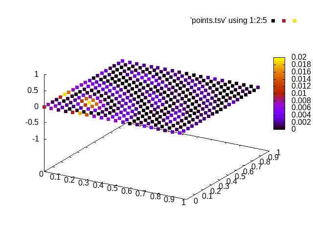

# neuralnets

Playing around with back-propagation algorithm.

`./run.sh`

### Fitted curve

### Actual curve

### Cost curve

refs
- [Backpropagation from the beginning](https://medium.com/@erikhallstrm/backpropagation-from-the-beginning-77356edf427d)
- [37 Reasons why your Neural Network is not working](https://blog.slavv.com/37-reasons-why-your-neural-network-is-not-working-4020854bd607)
- [Why does deep and cheap learning work so well?](https://arxiv.org/pdf/1608.08225.pdf)
- [Deep Learning Works in Practice.But Does it Work in Theory?](https://arxiv.org/pdf/1801.10437v1.pdf)
- [Visualizing and Understanding Convolutional Networks](https://arxiv.org/pdf/1311.2901.pdf)
- [The Unreasonable Effectiveness of Recurrent Neural Networks](http://karpathy.github.io/2015/05/21/rnn-effectiveness/)
